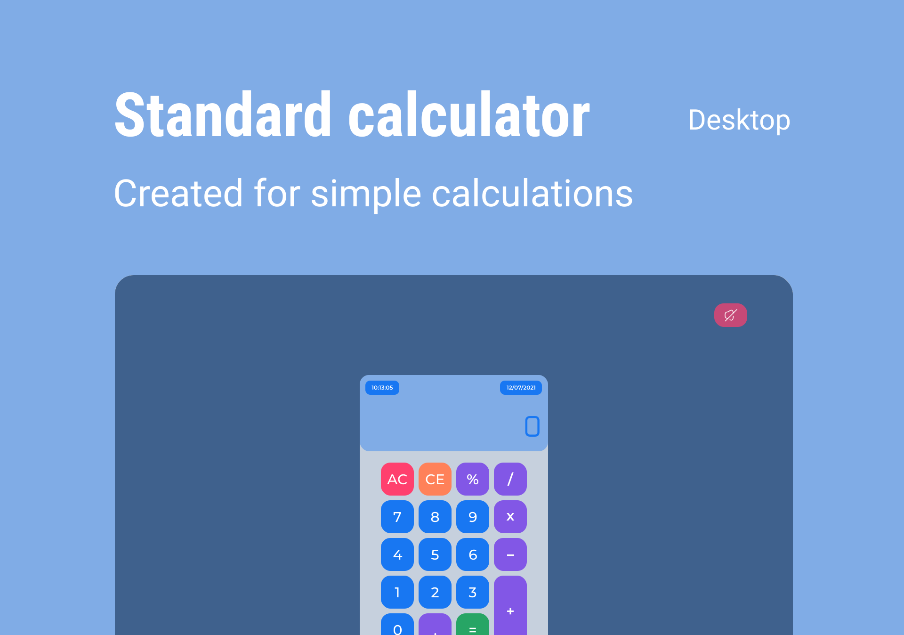

# Calculadora Padrão - JS
# Standard Calculator - JS

    

Calculadora padrão com ativação e desativação de som de teclas, desenvolvida em HTML5, CSS3,
e JS no "Curso Completo de JavaScript da Hcode na Udemy.com."

Standard calculator with activation and deactivation of some keys, developed in HTML5, CSS3,
and JS in "Hcode's Full JavaScript Course on Udemy.com."

### Projeto

<a href="#" target="_blank">Demonstração</a>

### Project

<a href="#" target="_blank">Demonstration</a>

### Como executar a aplicação?

    Passo 1 - Acesse a pasta standard_calculator;

    Passo 2 - Abra o arquivo index.html dando 2 cliques;

    Passo 3 - Será aberto em seu navegador padrão. Pronto! Só utilizar.

### How to run the application?

    Step 1 - Access the standard_calculator folder;

    Step 2 - Open the index.html file with 2 clicks;

    Step 3 - It will open in your default browser. Ready! Just use.